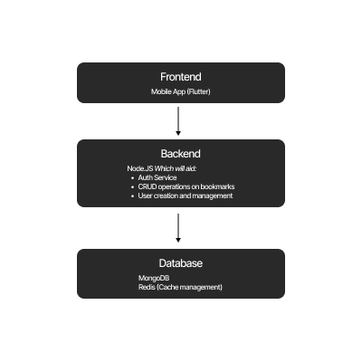
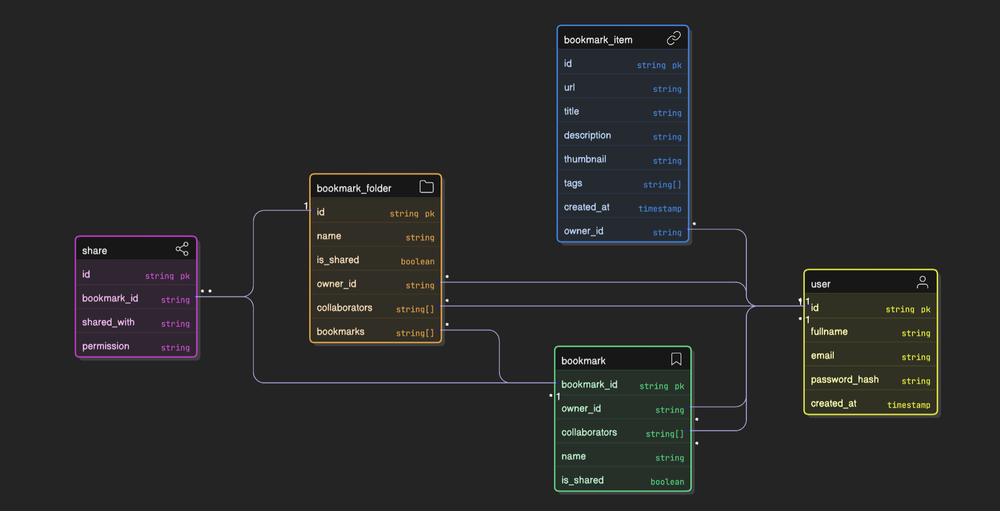
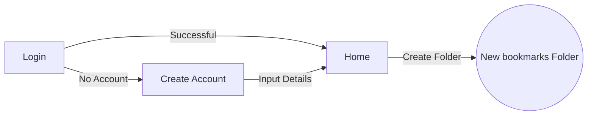

# System Architecture Design/Plan for Diaree

## 1. Introduction

### 1.1 Description
This document describes the system architecture and design for **Diaree** — a simple app that allows users to collect, organize, and share external web links and media into a centralized personal or shared folder that can be organised into folders.

### 1.2 Core Features
The app will:
 - Allow users to save bookmarks as a list of links, along with media from other apps on mobile.
 - Enable sharing of these bookmarks
 - Enable creation of bookmark folders (collections)
 - Enable sharing of bookmark folders (collections)
 - Store bookmarks to enable access from other devices

## 2. System

### 2.1 Overview
The simple aplication will follow a three-layer approach consisting of Frontend/Client, Backend/Server and Database.
- **Frontend (Client):** Mobile interface to present the system in an aesthetic format.
- **Backend (Server):** REST or GraphQL APIs for CRUD operations, authentication and sync with the database.
- **Database:** Store **all** user data

### 2.2 Architecture Diagram


### 2.3 Data Model
**Entities:**

-   **User**
    
    -   `id`, `fullname`, `email`, `password_hash`, `created_at`
        
-   **Bookmark Item**
    
    -   `id`, `url`, `title`, `description`, `thumbnail`, `tags[]`, `owner_id`, `created_at`
        
-   **Bookmark**
    
    -   `bookmark_id`, `name`, `owner_id`, `is_shared`, `collaborators[]`

-   **Bookmark Folder/Collection**
    
    -   `id`, `name`, `owner_id`, `is_shared`, `collaborators[]`, `bookmarks[]`
        
-   **Share**
    
    -   `bookmark_id`, `shared_with`, `permission (view/edit)`


### 2.4 Data Relationship


### 2.5 API Example
Below are examples of endpoints that can be expected in the API Design
```
POST /api/bookmarks         → create bookmark
GET /api/bookmarks/:id      → get bookmark
GET /api/folders/:id        → get folder bookmarks
POST /api/folders/share     → share a folder
```
**API Format:** REST (JSON) or GraphQL  
**Response Codes:** Standard HTTP (200, 201, 400, 404, 500)

### 2.6 Frontend User Flow
The expected flow for a new user into completing the main in-app task of creating a new folder is as follows:



## 3. Expected Deployment Architecture

-   **Environment:** Dev, Staging, Production
    
-   **Pipeline:** GitHub Actions → Docker → ECS → CloudFront

-  Mobile builds deployed via **App Store / Play Store**.
    
## 4. Future Enhancements

-   AI-powered link summarization
    
-   Bookmark deduplication
    
-   Smart tag suggestions
    
-   Offline sync for mobile
    
-   Public profile collections